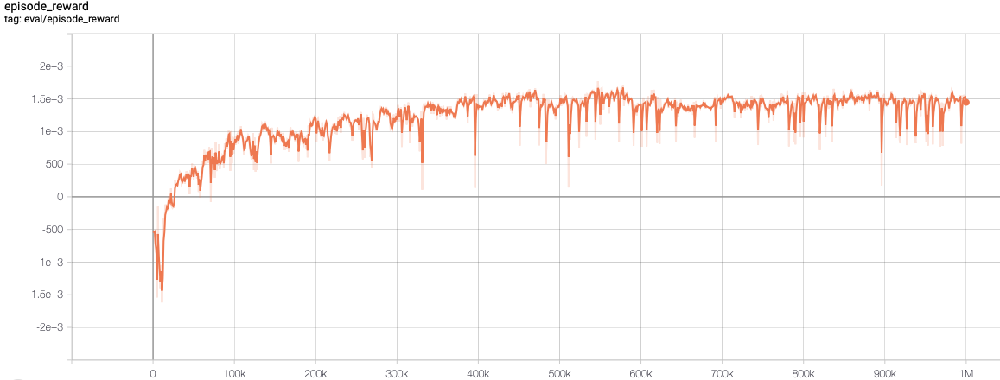

# RL_CARLA
## SAC in Carla simulator
Based on [PARL](https://github.com/PaddlePaddle/PARL) and [PaddlePaddle](https://github.com/PaddlePaddle/Paddle), 
a parallel version of SAC was implemented and achieved high performance in the CARLA environment.
> Paper: SAC in [Soft Actor-Critic: Off-Policy Maximum Entropy Deep Reinforcement Learning with a Stochastic Actor](https://arxiv.org/abs/1801.01290)

### Carla simulator introduction
Please see [Carla simulator](https://github.com/carla-simulator/carla/releases/tag/0.9.6) to know more about Carla simulator.

### Benchmark result



+ Result was evaluated with seed `0`, mode `Lane`

## How to use
### Dependencies:
+ System: Ubuntu 16.04
+ Simulator: [CARLA](https://github.com/carla-simulator/carla/releases/tag/0.9.6)
+ RL env: gym_carla
### Installation 
1. Create conda environment
    ```env
    $ conda create -n rl_carla python=3.6
    $ conda activate rl_carla
    ```
2. Download [CARLA_0.9.6](https://github.com/carla-simulator/carla/releases/tag/0.9.6), 
   extract it to some folder, and add CARLA to `PYTHONPATH` environment variable
   ```
   $ export PYTHONPATH="SOMEFOLDER/CARLA_0.9.6/PythonAPI/carla/dist/carla-0.9.6-py3.5-linux-x86_64.egg:$PYTHONPATH"
   ```
3. Clone repository from [this repo](https://github.com/ShuaibinLi/RL_CARLA.git)
    ```clone
    $ git clone https://github.com/ShuaibinLi/RL_CARLA.git
    ```
4. Install the packages
    ```
    $ pip install -r requirements.txt
    $ pip install -e .
    ```

#### Start Training
1. Open another(new) terminals, enter the CARLA root folder and launch CARLA service. 
   There are two modes to start the CARLA server: <br>
   (1) non-display mode
    ```start env
    $ DISPLAY= ./CarlaUE4.sh -opengl -carla-port=2021
    ```
   (2) display mode
   ```start_env
   $ ./CarlaUE4.sh -windowed -carla-port=2021
   ```
   + Start three CARLA services (ports: 2021,2023,2025) for collecting data and training, 
     one service (port: 2027) for evaluating.
     
2. For parallel training, we can execute the following [xparl](https://parl.readthedocs.io/en/stable/parallel_training/setup.html) command to start a PARL cluster：
   ```Parallelization
   $ xparl start --port 8080
   ```
   check xparl cluster status by `$ xparl status`

3. Start training
   ```train
   $ python train.py --localhost [xparl address]
   
   # Train for other settings
   $ python train.py --localhost [xparl address] --seed [int] --task_mode [mode]
   ```
#### Load trained model
```
python evaluate.py
